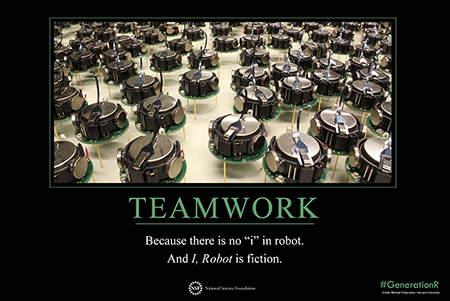

## Expectations in Computer Science
Many people when starting to dive into the field of Computer Science, myself included, may expect long and lonely hours in front of a computer. However we all know that this field is much more broad and collaborative than what we make it out to be! We all know that whether its a career in security, software development, or robotics, that teamwork is most likely needed. But how many of us actually stress the importance of actually becoming a part of a team? How many of us actually prepare and practice working with others? From my experience with fellow students, not many. Despite its lack of emphasis, teamwork is a necessity in this field. 

## Why teamwork is so important
Often enough, careers in Computer Science involve big projects and require people to collaborate and work in teams. I had my first glimpse of this experience during my years in highschool as a part of their robotics team. I was one of three programmers in a team of more than 15 people working on a single robot. When the builders made changes, we programmers also had to make the appropriate changes. When one programmer makes a change without informing the rest, our code had problems that would stump us for days. What I got back from this experience is that depending on the situation, teamwork and communication can make a significant difference. Even if a particular project may not necessarily fail without good teamwork, having it could definitely make things more efficient, organized, and faster. 

## Conclusion
While it isn't the newest revelation that teamwork is good, its importance isn't stressed enough, especially in this field where it is so prevelant. As students grow more involved in their profession, they are given more and more resources to help them connect with other fellow computer science majors. But preparing them for this in the earlier stages is also important and can help them get a better grasp on their professional career and what they should expect.
