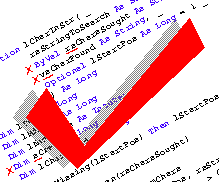
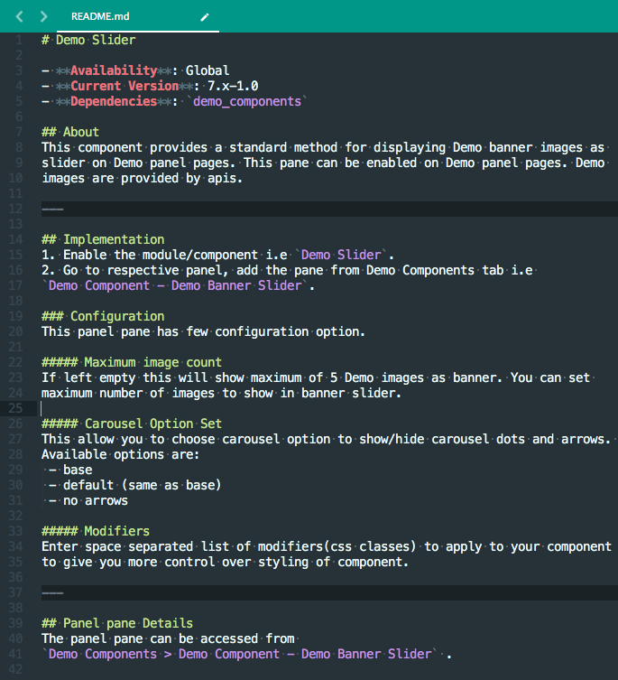

## What are coding standards?
Lets say you are collaborating with others on a big project only to find yourself lost reading their code. Frustrating right? Well coding standards can help. Coding standards are a set of rules and guidelines that define a coding style and are applied when writing code. These rules may vary depending on the author's preferences, but the main point is that the code style remains consistent when writing. These These coding standards allow a uniform and conventional coding style to be implemented throughout a project, making the written code easier to understand, improve, and manage. This in turn, improves overall efficiency when working with the code.  

## Why its important

There is no doubt that efficiency improves when coding standards are implemented and there are multiple reasons why. If you are a software engineer, you know that coding involves a lot of time spent reviewing the code written. Whether we are writing, debugging, or maintaining a piece of code, we have to review and understand it before making changes. Applying coding standards will automatically cut that time by a signficant margin by making it easier to find and understand pieces of code. Many projects also involve working in teams and by having a coding standard, a team will have an easier time integrating their work. It also allows other coders besides the author to have a clear understanding of how it works. This is especially important considering that a code's author may not be the one to make all the changes and maintain the code. Essentially, coding standards make it easier to work with other software engineers, detect problems, and improve the overall quality of the code.

## What coding standards should mean to you

As you can see in the image above, coding standards can make things more organzied and easy to read. Having such clean code is absolutely essential and sets a good foundation for anyone learning to program. I believe that coding standards are the most important software engineering technique that could be applied to improve overall code quality. Having a coding standard is not a technique that is only significant in one area of programming, but rather to all areas of software engineering. After having written codes without a strict coding standard nor a tool to enforce it, I noticed the subtle changes that good coding standards can bring. Coding references became easier to look through and spotting errors in my code became easier to spot. Not only that, but I also found it helpful when even in the midst of writing code. I don't believe that coding standards will directly impact a programmer such as making it easier to learn a new programming language. However, I do believe that it could indirectly help, such as making it easier to recognize how a piece of code is set up. Ultimately, applying a coding standard is a good habit for any software engineer and provides the simplest way to improve overall code quality.
