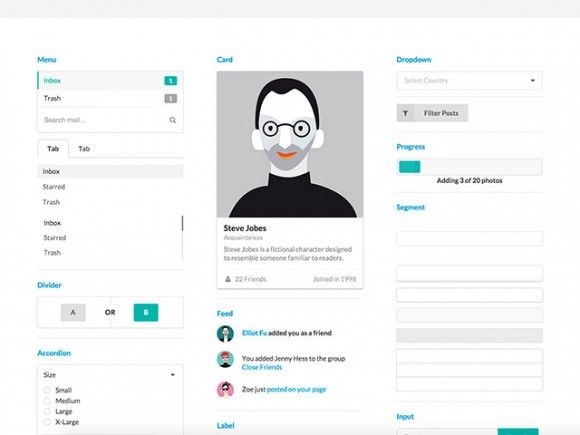

## What is a UI Framework?
When building web applications, many developers use UI(User-Interface) frameworks to design their code. UI frameworks are software tools to help front-end web developers build software programs to run on the web without having to design every component of the code. In other words, using a UI framework helps to implement a user interface with common web design goals. Many websites have common design goals such that their user interface requires similar componenets including buttons, controls, layouts, menus, and more. That is where a UI framework comes in as it has these components and styles pre-defined and ready to use. Despite its popularity however, UI frameworks are not necessarily required to build a web application and not everyone uses them. I will try to explain why some might choose to use them while others don't. 

## Advantages of a UI Framework
As mentioned above, UI frameworks helps provide many useful components in web design by defining them for you. But these components do not have to taken from the UI frameworks as one can design these components themselves. You might be wondering why one would choose to implement an element designed by someone else when you could create a totally customizable element of your own. This is because using UI frameworks offer clear advantages such as in time, design, and bugs. Just like any other piece of code, creating a totally customizable component of your own takes time, especially if you are trying to integrate it with the rest of the application. The code not only has to prove functionality with testing, but also has to work well with the other components. This is also plays into designing the application as you have to account for visual effects and styles. With UI frameworks, you also don't have to worry as much about the components they provide in regards to functionality or bugs since they have already been tested and cleaned up. In addition, implementing a UI framework gives a standard across the application, which can prove very useful for teams in re-usable components. Thus, you can save on time and have an easier time putting together the web application with less bugs to consider. 

Below, you can see examples of how Semantics UI has different components readily available for use.

## Why people don't use UI Frameworks
Despite the rich component set that a UI framework provides, some may choose not to use it. The components provided by UI frameworks are somewhat customizable, but with limitations. In some cases, an application may require a lot of customized components or might hardly use the UI framework. In such cases, using a UI framework may actually take longer and could make a big project very messy. It could also impact performance. This is because customizing defined components can sometimes be complicated with overwrites and additional steps, depending on what is desired. Instead of dealing with such complications, it can be simpler and cleaner to design your own. Implementing a UI framework can also impact an applications performance. For example, if you use only one or two components from the UI framework, it may be more worthwhile to create them yourself.

## You should learn UI Frameworks
Even though learning to use UI frameworks can be difficult and time consuming, I believe it is worth learning. Even if you may not need it for some projects, you'll likely have many other projects where it can prove very useful. The advantages that UI frameworks provide can make a significant impact in design, time, and overall costs. From my new experience with Semantics UI, I found that it was a very useful tool that was able to help design a homepage just as I desired. With that, I could tell that for many common web designs, UI frameworks can be used fully. Essentially, with the efficiency and styles that this can potentially bring is well worth the time invested in learning to use it.
